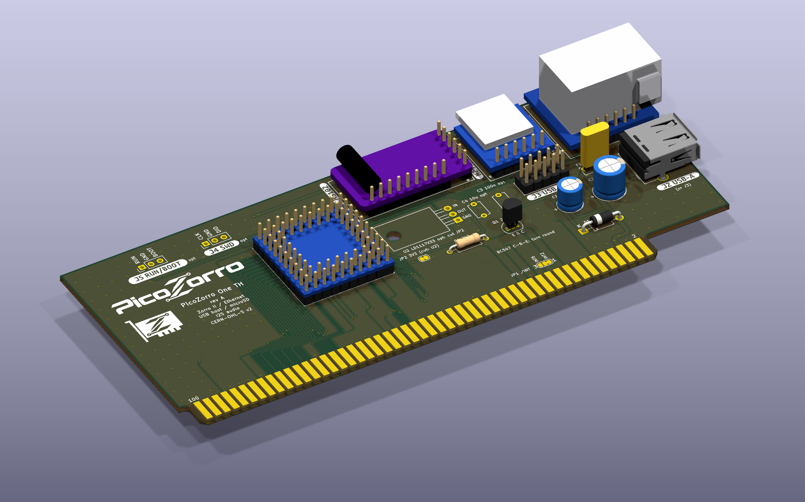

# PicoZorro

An RP2350 microcontroller on the Amiga **Zorro II** bus. PIO state machines
speak the bus protocol, XRDY inserts wait states while the firmware fetches
the data, and the card's registers appear in the Amiga's address space
through Autoconfig. No CPLD, no FPGA, no level shifters. Open hardware,
open firmware, open drivers.

The first card is the **PicoZorro One**: Ethernet, a USB host port and an
MP3 decoder for an A2000-class Zorro II slot. Its through-hole version, the
**PicoZorro One TH**, is built from off-the-shelf modules and a handful of
through-hole parts, so that anyone with a soldering iron can make one.

| What | How | Amiga side |
|---|---|---|
| Ethernet 10/100 | W5500 module on SPI | `picozorro.device`, a SANA-II driver (Roadshow, AmiTCP, ...) |
| USB host (full speed) | the RP2350's USB port | `picozorrousb.device` for Poseidon |
| MP3 / MP2 decoding | minimp3 on the card | `mpega.library`, a drop-in replacement for the 68k one |
| Boot ROM | the drivers served from the card | nothing to install: Kickstart loads them at boot |
| Firmware updates | A/B partitions in the module's flash | `pzflash` on the Amiga |

## Status

- Firmware and drivers run on a prototype (a Core2350B module on a carrier
  board) in an Amiga: Ethernet, USB mass storage, MP3 playback.
- The **PicoZorro One TH** board is designed, routed and passes ERC/DRC.
  It has **not been built yet**. Do not order boards until this says so.
- The default firmware build is the One's image (features `xrdy-direct`,
  `int-nfet`, `usb-host`); the One TH and the One SMD share one pin map
  and one image. The four pins that differ from the prototype
  (microSD chip select, I2S) are unused, and the text log on GPIO46 lands
  on the DAC's bit-clock pin, which is harmless while no DAC is fitted.
- microSD and the I2S DAC are on the board for later; no firmware uses
  them yet.

## Repository

| Path | What |
|---|---|
| `hardware/picozorro-one-th/` | KiCad project, fabrication files, parts list and design notes of the One TH |
| `hardware/lib/` | the PicoZorro KiCad library (the Zorro II edge connector) |
| `hardware/EDGE_CONNECTOR.md`, `hardware/PINMAP.md` | edge-connector orientation with its evidence; the GPIO map |
| `firmware/` | RP2350 firmware in Rust on embassy: `pz-core` (Autoconfig, register window, network model, host tests), `pz-hal`, `pz-app` (the `picozorro` image, `hello`, `nic-demo`, `bus-listen`) |
| `amiga/` | the Amiga drivers, `mpega.library`, `pzflash`, the boot ROM, test and diagnostic tools; built with bebbo's GCC in docker |
| `tools/` | firmware image tools: update file, boot image, flashing |
| `docs/` | the register interface (`REGISTERS.md`, `REGISTERS-USB.md`, `REGISTERS-MPEG.md`), firmware updates (`UPDATE.md`), Zorro II electrical facts |

## From a bare board to a network

1. Build the card: `hardware/picozorro-one-th/README.md` (parts list,
   fabrication files, what to check before the first power-up).
2. Build the Amiga software once, it goes into the firmware's boot image:

       make -C amiga toolchain   # once: pulls the image, fetches NDK 3.2 and the Poseidon headers
       make boot                 # drivers + boot ROM -> firmware/boot.img

3. Build and install the firmware, module on the bench, not in the Amiga:

       make fw-uf2               # firmware/picozorro-install.uf2

   Hold BOOTSEL while plugging the module's USB into the PC and copy
   `picozorro-install.uf2` onto the USB drive that appears. With an SWD
   probe, `make fw-install` does the same over SWD. This writes the A/B
   partition layout, so later updates come from the Amiga
   (`docs/UPDATE.md`), no cable needed. The UF2 route has not been
   exercised on a module yet; the SWD route has.
4. Card in the slot, Amiga on. Kickstart finds the card (manufacturer 2011,
   product $5A), loads `picozorro.device`, `picozorrousb.device` and
   `mpega.library` from it. Point your TCP/IP stack at `picozorro.device`
   unit 0 and Poseidon at `picozorrousb.device`: `amiga/README.md`.

Other targets: `make` (host tests + every firmware binary), `make amiga`,
`make fw-uf2 BIN=hello` (a first-light image as UF2), `make check-one-th`
(ERC + DRC). Needs: rustup (stable; the toolchain file adds the target),
arm-none-eabi-gcc (the MP3 decoder is C), picotool, probe-rs with RP2350
support for SWD, cargo-binutils for the update and install files; for `make amiga`:
docker, lha, curl. Details in `firmware/README.md` and `amiga/README.md`.

## Safety

The card sits on the CPU bus of a machine that is not made any more.
Open-collector lines (XRDY, /INT2, /INT6) are never driven high. The
edge-connector orientation is documented with its evidence in
`hardware/EDGE_CONNECTOR.md`; check it against your board before powering
anything.

## Why the RP2350 sits on the 5 V bus without level shifters

The Zorro II bus is 5 V TTL. The RP2350's GPIO0-39 are fault-tolerant pads:
Raspberry Pi specifies them to 5.5 V **as long as IOVDD (the chip's 3.3 V)
is powered**. With IOVDD at 0 V the same pad is only rated to 3.63 V, and the
datasheet says a pad above that with IOVDD off will be damaged. So the whole
question is the first milliseconds after switch-on: can the bus be above
3.63 V before the card's 3.3 V regulator has come up?

Reasoning first: the bus drivers and pull-ups are fed from the same +5 V
rail that feeds the card's regulator, so no bus line can be ahead of that
rail. Below regulation an LDO just passes its input minus a drop, so IOVDD
follows the rail closely. The datasheet's limit only bites if the regulator
*delays* its start by more than the time the rail needs to travel from where
the LDO can start (about 2.3 V) to 3.63 V.

Then measured, with a logic analyser's analog channels:

- An Amiga's Zorro +5 V rises to 5.1 V in 3.4 ms; **2.3 V to 3.63 V takes
  about 1 ms**, 3.63 V to 4.2 V another 0.5 ms.
- The Core2350B's regulator (ME6217, 3.3 V), hit with a hard 5 V step on its
  input as the worst case: **3V3 reaches 3 V about 50 us later.**

50 us against 1 ms is a 20x margin, and on the real ramp the regulator does
not even see a step. IOVDD is therefore always above 1.8 V when the bus
passes 3.63 V and above 2.5 V when it passes 4.2 V, which is what the
datasheet's rating table asks for. The silicon on the module is an A4
stepping, the one Raspberry Pi qualified as 5 V tolerant; the erratum that
made A2 parts leak (RP2350-E9) is fixed from A3 on.

What this does **not** cover: hot-plugging a card into a live machine, or a
card whose 3.3 V rail is dead while the bus is up. Both put 5 V on unpowered
pads. Don't.

## Licence

Copyleft on purpose: forks stay open.

- Firmware, tools and the Amiga software: **GPL-3.0-or-later**
  (`LICENSES/GPL-3.0-or-later.txt`). The Rust dependencies (embassy and
  friends, MIT / Apache-2.0) are compatible. Vendored code keeps its own
  licence: `firmware/vendor/`.
- Hardware (`hardware/`): **CERN-OHL-S-2.0**, strongly reciprocal
  (`LICENSES/CERN-OHL-S-2.0.txt`).
  One 3D model, `hardware/picozorro-one-th/3d/PCM5102-I2S.step`, comes from
  the zynthian-miniature project under GPL-3.0 (`3d/SOURCES.txt`).
- Documentation: **CC BY-SA 4.0** (`LICENSES/CC-BY-SA-4.0.txt`).

Copyright Maxime Vincent.
