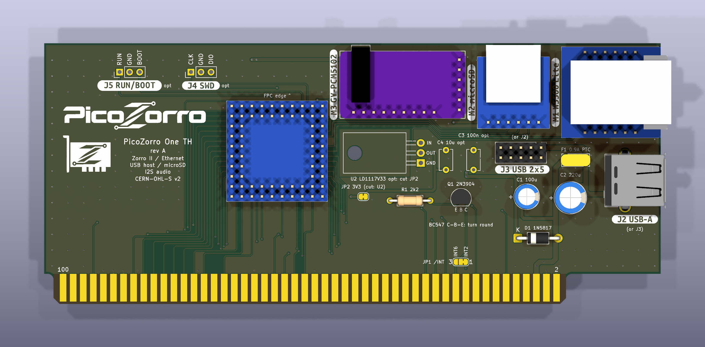
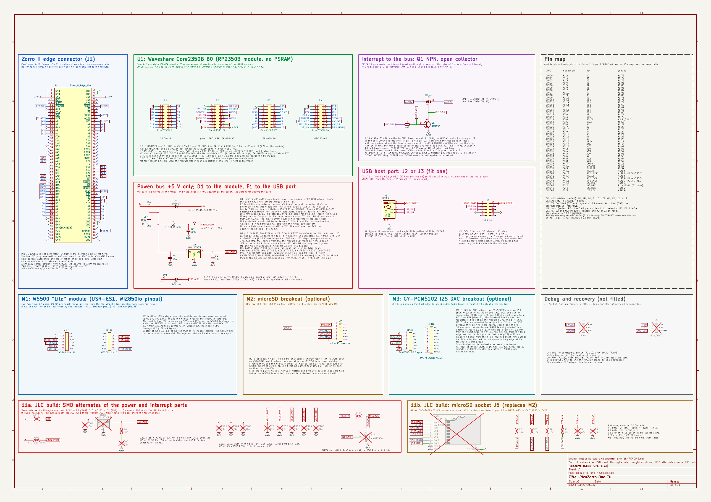

# PicoZorro One TH

The PicoZorro One is the Zorro II network and USB card of the PicoZorro
project. The One TH is its through-hole version: bought modules and a
handful of through-hole parts on a bare two-layer PCB, soldered by hand.

- RP2350B: a Waveshare Core2350B module (B0 variant, no PSRAM) on four
  2x8 pin strips. Its PIO state machines speak the Zorro II bus directly.
- Ethernet: a W5500 "Lite" module (USR-ES1, WIZnet WIZ850io pinout) on SPI1.
- USB host: the RP2350's own USB port, to a type A receptacle or a PC-style
  2x5 internal header.
- Optional: a microSD breakout on SPI1 and a GY-PCM5102 I2S DAC breakout.



## Status

Rev A. The schematic and the routed board pass KiCad ERC and DRC with zero
violations (`make check-one-th` at the top of the repository).
**The board has not been built or tested in an Amiga. Do not order boards
yet.** The open points are listed at the end of this file.

## Files

| Path | What |
|---|---|
| `picozorro-one-th.kicad_pro`, `.kicad_sch`, `.kicad_pcb`, `.kicad_dru` | KiCad 10 project; the edge-connector symbol and footprint come from `../lib` |
| `fab/gerbers/`, `fab/picozorro-one-th-gerbers.zip` | Gerber and Excellon drill files for a two-layer order |
| `fab/order-notes.txt` | the options to pick in the order form |
| `fab/picozorro-one-th-parts.csv` | parts list for buying (includes the not-fitted parts, marked DNP) |
| `3d/` | STEP models of the modules and the PTC that the board references; origins and licences in `3d/SOURCES.txt` |
| `images/` | schematic (PDF, PNG), copper and silkscreen views, 3D renders (top and isometric) |

There are no assembly (pick-and-place) files: everything is soldered by hand.



## What the builder solders

| Ref | Part | Value / type | Package | Fitted |
|---|---|---|---|---|
| U1 (P1-P4) | Waveshare Core2350B module, B0 (no PSRAM) | - | four 2x8 2.54 mm pin strips | yes |
| M1 | W5500 "Lite" module (USR-ES1, WIZ850io pinout) | - | two 1x6 2.54 mm rows | yes |
| M2 | microSD breakout, 3.3 V, no level shifter | - | one 1x6 2.54 mm row | optional |
| M3 | PCM5102A DAC breakout "GY-PCM5102" | - | 1x6 row (signals) + 1x9 row (holding only) | optional |
| D1 | Schottky diode | 1N5817 | DO-41, 10.16 mm | yes |
| F1 | resettable PTC fuse, 30 V (or 16 V) family | 0.9 A hold, e.g. Littelfuse RUEF090 | radial, 5.08 mm leads | yes |
| C1 | electrolytic capacitor, bus +5 V | 100 uF | radial, D6.3 mm, 2.5 mm pitch | yes |
| C2 | electrolytic capacitor, USB port | 220 uF | radial, D8 mm, 3.5 mm pitch | yes |
| Q1 | NPN transistor | 2N3904 | TO-92, E-B-C | yes |
| R1 | resistor, GPIO45 to Q1 base | 2.2 k | axial, DIN0207, 10.16 mm | yes |
| J2 | USB 2.0 type A receptacle, right angle | Molex 67643 pattern | through-hole | one of J2 / J3 |
| J3 | PC internal USB header | 2x5, pin 9 absent | 2.54 mm header | one of J2 / J3 |
| U2 | 3.3 V regulator (fallback) | LD1117V33 | TO-220, lying down | no |
| C3, C4 | U2 input / output capacitors | 100 nF / 10 uF | disc, 5 mm pitch | no |
| J4 | SWD header: SWCLK / GND / SWDIO | - | 1x3 2.54 mm | no (developers) |
| J5 | recovery header: RUN / GND / BOOTSEL | - | 1x3 2.54 mm | no (recovery) |

The fab parts list with footprints is `fab/picozorro-one-th-parts.csv`.

F1 alternatives: Littelfuse RUEF090 or 30R090U, Bourns MF-R090-0-9,
Littelfuse RUSBF090 (0.07-0.12 ohm new, 0.22 ohm at most after a trip;
holds 0.57-0.61 A at 60 C). Not the 0.5 A hold parts: they hold 0.36 A at
50 C and drop up to 0.59 V. The footprint is KiCad's
`Fuse_Bourns_MF-RHT070` (5.1 mm lead spacing with the 1.2 mm stagger of a
radial PTC's leads, 0.71 mm holes for 0.51 mm leads); the KiCad library
has no footprint for the parts named above.

Q1 alternatives: the footprint is three holes in line, base in the middle,
emitter - base - collector as pins 1-2-3.

| Part | Pin order 1-2-3 | Fits |
|---|---|---|
| 2N3904, PN2222A, 2N4401, S8050 | E-B-C | as drawn |
| BC547, BC548, BC337 | C-B-E | rotated 180 degrees (silkscreen: "BC547 C-B-E: turn round") |

Only the 2N3904 and the BC547 were checked against a data sheet; check the
others before fitting.

U2 alternatives (pin order GND / VOUT / VIN seen from the front, tab =
VOUT): LD1117V33, LM1117T-3.3, AZ1117T-3.3, LM1086CT-3.3, LT1086CT-3.3.
They do not fit with VIN and VOUT swapped, middle pin GND, tab GND: LF33CV,
LM3940IT-3.3, MCP1825S, MCP1826S. The silkscreen names the three holes.

## Solder jumpers

Both are bridged by a trace as delivered.

| Jumper | Default | Change |
|---|---|---|
| JP1 | 1-2: Q1 collector to /INT2 (J1 pin 19) | cut 1-2 and bridge 2-3 for /INT6 (J1 pin 22) |
| JP2 | module 3V3 (U1 P2.16) feeds 3V3_AUX (M1, M2) | cut it when U2 is fitted; never fit U2 with JP2 bridged |

## Pin map

The PicoZorro GPIO map (`../PINMAP.md`) applies to GPIO0-17, 19-43 and 45.
Four pins differ on this board:

| GPIO | Module pin | Shared map | This board |
|---|---|---|---|
| 18 | P3.6 | /LDS | microSD chip select |
| 44 | P4.15 | /ARM | I2S data (DIN) |
| 46 | P2.4 | UART0 TX | I2S bit clock (BCK) |
| 47 | P2.3 | not connected / PSRAM chip select | I2S word clock (LCK), B0 module only |

The whole map:

| GPIO | Signal | Goes to |
|---|---|---|
| 0-15 | D0-D15 | J1 |
| 16 | /AS | J1 74 |
| 17 | /UDS | J1 72 |
| 18 | SD_CS | M2 pin 2 |
| 19 | READ | J1 68 |
| 20-26 | A1-A7 | J1 |
| 27 | XRDY | J1 18, direct |
| 28-35 | A16-A23 | J1 |
| 36 | /CFGIN | J1 12 |
| 37 | /CFGOUT | J1 11 |
| 38 | /BUSRST | J1 94 |
| 39 | NIC_INT | M1 INTn (the module's LED1 is on the same pin, lit while INTn is high) |
| 40 | SPI1 MISO | M1, M2 |
| 41 | NIC_CS | M1 SCSn |
| 42 | SPI1 SCK | M1, M2 |
| 43 | SPI1 MOSI | M1, M2 |
| 44 | I2S_DIN | M3 |
| 45 | INT_DRV | R1, Q1 base |
| 46 | I2S_BCK | M3 |
| 47 | I2S_LCK | M3 |

Bus signals use only GPIO0-38 (5 V tolerant); GPIO39-47 never see the bus.
The bus nets go straight from the edge fingers to the module pins: no series
resistors, no buffers. XRDY comes from GPIO27 directly (36 ns from /AS to
XRDY measured at 240 MHz). The edge connector (J1) has +5 V on pins 5 and
6, all GND pins connected and pin 91 tied to GND.

There is no UART: debug is SWD with RTT on J4.

**/LDS (J1 pin 70) is not connected.** The bus PIO programs wait on /AS and
branch on READ only; the strobes are two bits of the sampled word, used by
the register model to tell word from byte access. With /UDS alone, word
access, Autoconfig (its writes are /UDS-only bytes on D15-D8) and the
rejection of an odd-byte write (/UDS high) work; an even-byte write cannot be
told from a word write and is taken as a word write.

**GPIO47 and the module variant.** On the Core2350B B1 / B2 modules the PSRAM
chip select sits directly on GPIO47 with a 10 k pull-up (R9); R11 (0 R) only
links the net to header pin P2.3. Driving GPIO47 there selects the PSRAM
during flash access. I2S therefore needs the B0 module, and the firmware
must not drive GPIO47 unless a PSRAM probe has found none.

### Firmware

The default firmware build is this board's image: its features
`xrdy-direct` (GPIO27 pulls XRDY) and `int-nfet` (GPIO45 push-pull, high
asserts /INT) match the bus side. The One TH and the One SMD share one pin
map and one image. GPIO18 / 44 / 46 / 47 may only be driven by a firmware
built for this board. The microSD and I2S
drivers are not written yet. When they are:

- SPI1 is shared. The SD card releases its data output one clock after its
  chip select rises, so the firmware clocks one byte with both chip selects
  high before selecting the W5500; each device gets its own SCK rate.
- An SD card that has not been put into SPI mode still listens to the
  command line. The firmware initialises the card before network traffic
  starts; a card inserted later sees W5500 traffic first.
- I2S is enabled only after a PSRAM probe has found none.

## Power

```
J1 +5V --+-- C1 --GND
         |
         +-- D1 -->|-- VIN ---- U1 P2.15 (VBUS: module LDO input)
         |                 +--- M3 VIN
         |
         +-- F1 ---+--- VBUS_PORT --- J2.1, J3.1, J3.2
         |         +--- C2 --GND
         |
         +-- U2 (not fitted) --- 3V3_AUX

U1 P2.16 (3V3, module LDO output) --- JP2 --- 3V3_AUX --- M1, M2
```

- **D1** (Schottky) keeps bench power off the Amiga's +5 V rail: the
  module's FPC USB adapter feeds the same VBUS net.
- **F1** (PTC) is all there is between the bus +5 V and the USB port, as on
  PC motherboards (Intel 815E reference board; Intel, "Power Delivery Design
  Issues for Hi-Speed USB on Motherboards") and the fuse-only hobby host
  boards. No series diode (with a Schottky the port sat at about 4.45 V), no
  power switch IC.
- The card is powered by the Amiga, or by the FPC adapter on the bench. The
  port never powers the card.
- Not protected: a hub that feeds its own 5 V back into the port reaches the
  Amiga's +5 V rail through F1, also with the Amiga switched off. USB 2.0
  section 7.2.1 forbids a device to source current on its upstream port.

Port voltage from a 5.0 V rail at 500 mA: 5.0 - 0.06 (F1 new, 0.11 after a
trip) = 4.94 V (4.89 V). USB 2.0 Table 7-7 asks for 4.75 V at a high-power
port, so the rail may sag to 4.86 V. USB 2.0 section 7.2.4.1 asks for at
least 120 uF on a downstream port: C2. Section 7.2.1.2.1 asks for
resettable over-current protection below 5.0 A: F1 trips at 1.8 A (Intel's
guide sizes a single-port fuse at 1.5 A trip or more). The fault is not
reported to the host stack: there is no pin for it.

3.3 V: the module's ME6217C33M5G LDO (SOT-23-5, 800 mA absolute maximum,
limited by package dissipation) supplies the module, M1 (132 mA typical)
and M2 (100 mA average maximum, 300 mA peaks of 10 us). M3 is not on this
rail: its VIN comes from VIN and it has its own two regulators. Measured
with a thermal camera, module plus W5500 on the module's 3V3, room 20 C:
nothing on the module above 40 C (no SD card in that measurement).

Fallback, not fitted: U2 takes the bus +5 V directly (an LD1117V33 needs
4.45 V at 500 mA and is specified from 4.75 V, which VIN does not
guarantee). Fitting U2 means cutting JP2: 3V3_AUX (M1, M2) then comes from
U2 and the module LDO feeds only the module. With U2 fitted and only bench
power, M1 and M2 are unpowered. C3 100 nF at the input, C4 10 uF at the
output (ST's figures; ST gives no ESR window).

There is no extra bulk capacitance on VIN or 3V3: it would slow the 3V3
rise against the Amiga's +5 V ramp.

## /INT driver

Q1, an NPN transistor, drives the interrupt line open collector: emitter to
GND, base through R1 (2.2 k) to GPIO45, collector through JP1 to /INT2
(default) or /INT6. GPIO45 high asserts the interrupt. GPIO45 resets with
its pull-down on, so Q1 is off while the module is in reset; with the module
absent the base is open and Q1 is off. GPIO45 is not 5 V tolerant, so it
cannot pull the bus line itself.

Sizing: a B2000 and an A500+ pull both lines up with 1 k (5 mA at 5 V); the
Technical Reference Manual's open-collector drive class is 0.5 V at 8 mA,
so the driver must sink at least 8 mA. R1 gives (3.3 - 0.75) / 2.2 k =
1.2 mA of base current. The 2N3904 is specified at VCE(sat) 0.2 V maximum
for 10 mA with 1 mA into the base, the BC547 at 0.25 V maximum (0.09 V
typical) for 10 mA with 0.5 mA: both operating points are covered with
margin.

A transistor and not a MOSFET: the through-hole MOSFETs hobby shops carry
(2N7000, BS170) have gate thresholds up to 3 V and are not specified at
3.3 V drive; the one that is (TN0702) is a distributor-only part. Small NPN
types are sold everywhere.

Simulated with ngspice (vendor models, 1 k to 10 k pull-ups, 4.75 to
5.25 V, 0 to 70 C, GPIO45 down to 3.0 V, R1 +5 %): /INT sits below 90 mV
with a 2N3904 and below 40 mV with a BC547B, also at a forced 8 mA;
GPIO45 sources 1.15 mA at most. Assertion takes under 125 ns into 1 nF.
Release is the pull-up RC plus the transistor's storage time: 0.25 to
0.5 us for the 2N3904, 1.4 to 2.2 us for the BC547B, so 10 k with 500 pF
reaches 2.0 V after 3.2 us (2N3904) or 4.9 us (BC547B). The 2N3904 is the
default for that reason.

## Modules

**M1, W5500 Lite.** Two 1x6 rows, 2.54 mm pitch, 20.32 mm apart; module
23.0 x 25.0 mm; pin 1 of each row at the jack-opening end, 6.4 mm from that
edge; the jack overhangs that edge by 2.5-2.7 mm. Seen from the top with the
jack opening away from the viewer (module silk J1 left, J2 right, jack
HR961160C):

| Left row (J1) | | Right row (J2) | |
|---|---|---|---|
| 1 GND | GND | 1 GND | GND |
| 2 GND | GND | 2 3.3V | 3V3_AUX |
| 3 MOSI | GPIO43 | 3 3.3V | 3V3_AUX |
| 4 SCLK | GPIO42 | 4 NC | - |
| 5 SCNn | GPIO41 | 5 RSTn | not connected |
| 6 INTn | GPIO39 | 6 MISO | GPIO40 |

RSTn stays open: the module has its own power-on reset (10 k, 100 nF,
1N4148) and the firmware resets the chip in software. The module has 10 k
pull-ups on SCSn and INTn, so the W5500 is deselected while the RP2350 is
in reset.

**M2, microSD breakout.** One 1x6 row: 3V3 (pin 1, to 3V3_AUX), CS (GPIO18),
MOSI (GPIO43), CLK (GPIO42), MISO (GPIO40), GND. Board 18 x 18 mm (18.1 mm
over its scored edges); the socket, 13.7 mm wide, overhangs the edge
opposite the pin row by 3 mm and the card enters from there. No pull-up on
the chip select: GPIO18 resets with its pull-down on (about 50-80 k), which
selects the card while the RP2350 is in reset; nothing is clocked then, and
the firmware drives the chip select high as soon as it has configured its
GPIOs, before it uses SPI1. The breakout carries four 10 k pull-ups of its
own, on lines not identified.

**M3, GY-PCM5102.** The 6-pin row on its short edge: SCK to GND (selects the
PCM5102A's internal PLL), BCK to GPIO46, DIN to GPIO44, LCK to GPIO47, GND,
VIN to VIN. Pin 1 is SCK. The 9-pin row (FLT, DEMP, XSMT, FMT, A3V3, AGND,
ROUT, AGND, LROUT from the SCK corner) gets nine unconnected holes: it only
holds the board. Audio leaves through the breakout's 3.5 mm jack. The four
strap bridges on its underside stay as usually delivered: FLT low, DEMP
low, XSMT high, FMT low. BCK and LCK are on consecutive GPIOs so one PIO
side-set drives both; PLL mode accepts BCK = 32 fs or 64 fs from 32 kHz to
384 kHz. Geometry, from a third-party footprint (sstojos,
zynthian-miniature) cross-checked against board photos: board 31.6 x
17.0 mm; the 6-pin row 1.5 mm from the short edge; the 9-pin row 1.5 mm
from the long edge next to the SCK pin, its first hole (FLT) 6.35 mm along
the board from the 6-pin row and 0.635 mm outside the SCK hole.

## USB host port, debug and recovery

- The module's USB pins (D+ on P2.9, D- on P2.7, 27 R on the module) go to J2
  and J3 in parallel; only one of the two is fitted.
- **J2**: through-hole type A, right angle, the hole pattern shared by Molex
  67643, Stewart SS-52100-001, Kycon KUSBX-AS1N and Connfly DS1095. 1
  VBUS_PORT, 2 D-, 3 D+, 4 GND, shell to GND.
- **J3**: 2x5, pin 9 absent (key). 1 and 2 VBUS_PORT, 3 D-, 5 D+, 7 and 8
  GND; 4, 6 (a second port's data) and 10 (over-current sense on a PC) not
  connected. A PC slot bracket's first socket works, its second has power
  only. A 1x4 cable fits the odd row.
- **J4** (SWD): SWCLK (P2.10), GND, SWDIO (P2.6), placed clear of every
  other connector.
- **J5**: RUN (P2.11), GND, BOOTSEL (P2.5). RUN to GND resets the card; with
  BOOTSEL held to GND the RP2350 starts its USB bootloader. The module's FPC
  adapter has both as buttons.

## Mechanical

- Plain rectangle, no nose, bracketless, two layers, 1.6 mm FR-4.
  155.5 x 65.92 mm including the 7.62 mm tongue; the body is 58.3 mm above
  the shoulder, the low-profile PC card envelope.
- Edge connector: 2 x 50 gold fingers at 2.54 mm, orientation and geometry
  in `../EDGE_CONNECTOR.md`. ENIG with a 0.5 x 45 degree bevel on the
  finger edge is recommended; HASL works. The finger area is one open
  solder-mask window by design.
- All parts go on the component side. The pin 1 / 2 end faces the rear panel
  on the Denise; the RJ45 and the USB-A socket go to that end. Tall parts
  sit high on the card, away from the fingers, to clear an accelerator; the
  15 mm band above the fingers holds only lying axial parts and the solder
  jumpers.
- Heights above the PCB: M1 about 17.8 mm (2.54 mm header plastic + 1.6 mm
  PCB + 13.61 mm jack; the header plastic cannot be left out, the W5500 sits
  on the module's underside); U1 on its header plastic (parts on its
  underside); U2, if fitted, lying down.
- **The tall parts do not clear a neighbouring card.** Free height to the
  next card's PCB is 13.6 mm on the Denise and 18.7 mm in an A2000, before
  that card's solder-side leads. M1 needs the adjacent slot on its side
  empty in every machine.

| Target | Body height | Length | Slot pitch |
|---|---|---|---|
| Enterlogic A-NIC outline | 45.1 | 155.5 | - |
| Denise, low-profile PC card envelope | 58.3 max | about 168 | 15.24 |
| Denise, full-height PC card envelope | 100.6 max | about 171 over the board | 15.24 |
| A2000 and the Zorro II form factor | 114.5 max | 337.19 max | 20.32 |

On the Denise the card's shoulder rests 13.97 mm above the motherboard
(EDAC 745-100-520-206, notched ends), and the card goes into the slot next
to the CPU (CN4). Mini-ITX guarantees only 57 mm of free height over that
slot, which is a 43.0 mm body; the One TH relies on the case for the rest.

## First power-up

1. Before soldering the module: confirm the edge connector's orientation
   against `../EDGE_CONNECTOR.md` on the bare board (pins 2 and 4 are GND,
   pin 6 is +5 V; they sit at the rear/bracket end). Then, with the strips
   soldered and nothing else fitted, check for shorts between +5 V, 3V3
   and GND.
2. On the bench, not in the Amiga: build `hello` as a UF2 (`make fw-uf2
   BIN=hello` at the top of the repository), hold BOOTSEL (J5, or the FPC
   adapter's button) while the module powers up from its FPC adapter, and
   copy `firmware/hello.uf2` onto the USB drive that appears. Its USB CDC
   log shows the chip's stepping and MAC. D1 keeps this bench power off
   the bus pins.
3. First time in the Amiga: `bus-listen` the same way (`make fw-uf2
   BIN=bus-listen`, `firmware/bus-listen.uf2`). It drives nothing on the
   bus and prints the bus pins and the /AS statistics once a second on the
   USB CDC log, so a wrong finger shows up before anything is driven.
4. Then the card's firmware: `make fw-uf2`, drop
   `firmware/picozorro-install.uf2` the same way (or `make fw-install` with
   an SWD probe; `docs/UPDATE.md`), and `pztest` on the Amiga finds the
   card and exercises its scratch register.

## Open points

- ME6217 temperature with an SD card fitted as well (40 C at most with M1
  alone).
- The 3V3 rise against the Amiga's +5 V ramp with M1 and M2 loading the
  rail. Measured only for the bare module: 18.6 us.
- /LDS: the firmware ignoring /LDS is tested on a Denise (register test,
  network, USB and Autoconfig after a reset unchanged), but not yet with
  the pin physically unconnected.
- Q1 on the bus: the NPN driver is simulated only. The firmware's
  `int-nfet` drive was run against a 2N7002 MOSFET, not an NPN transistor.
- GY-PCM5102: no maker document. Pin order confirmed from the silkscreen;
  the geometry is a third party's footprint that agrees with photo
  measurements to about 0.2 mm, not a measurement on a board.
- F1: the footprint is that of another radial PTC family; any PTC close to
  the rating fits those holes.
- microSD breakout: no maker document. Pin order, 3V3 end, socket overhang,
  board size and socket width are measured; the position of the row and of
  the socket along their edges (socket centred) is assumed; the lines of its
  four pull-ups are unknown.
- Whether R9 / R11 are fitted on the B0 module (expected: yes, so GPIO47
  has a 10 k pull-up and reaches P2.3).
- B2000 pull-ups are from drawing 312726 rev 2 only; the Denise's own /INT
  pull-ups are not measured.
- The free space next to CN4 on the Denise with an accelerator fitted (the
  TF536), at the height where the modules sit. Denise positions were
  measured on a board render; the PC envelope figures are PCI Express (CEM
  3.0 Fig 9-26); A3000 / A4000 limits beyond the form factor are not
  checked; Commodore gives no component-height limits.
- The release time of /INT against Exec clearing INTREQ after the server
  chain is not measured.
- Firmware for microSD and I2S does not exist yet.

## Sources

- Core2350B schematic: https://files.waveshare.com/wiki/Core2350B0/Core2350B.pdf
- WIZ850io: https://docs.wiznet.io/Product/ioModule/WIZ850io
- USR-ES1 manual (copy): https://iarduino.ru/lib/273f9e795d4abeaeecb3b027cae523ba.pdf
- HR961160C jack: https://wmsc.lcsc.com/wmsc/upload/file/pdf/v2/lcsc/2410122008_HANRUN-Zhongshan-HanRun-Elec-HR961160C_C55683.pdf
- ME6217: https://www.lcsc.com/product-detail/C427602.html
- 2N3904: https://www.onsemi.com/pdf/datasheet/2n3903-d.pdf
- BC547: https://www.onsemi.com/pdf/datasheet/bc546-d.pdf
- 2N7000 (why not): https://www.onsemi.com/download/data-sheet/pdf/nds7002a-d.pdf
- 1N5817: https://www.onsemi.com/download/data-sheet/pdf/1n5817-d.pdf
- Intel, Power Delivery Design Issues for Hi-Speed USB on Motherboards: https://www.usb.org/sites/default/files/power_delivery_motherboards.pdf
- Intel 815E Platform Design Guide (reference board sheet 21): https://download.intel.com/design/chipsets/designex/29823401.pdf
- RUEF: https://www.littelfuse.com/assetdocs/resettable-ptc-ruef-datasheet?assetguid=2139d828-f887-4a2a-9b25-01ddf761ab3a
- MF-R: https://www.bourns.com/docs/Product-Datasheets/mfr.pdf
- LD1117: https://www.st.com/resource/en/datasheet/ld1117.pdf
- LF33: https://www.st.com/resource/en/datasheet/lfxx.pdf
- PCM5102A: https://www.ti.com/lit/ds/symlink/pcm5102a.pdf
- GY-PCM5102 (community drawing): https://macsbug.wordpress.com/2021/02/19/web-radio-of-m5stack-pcm5102a-i2s-dac/
- GY-PCM5102 footprint (third party): https://github.com/sstojos/zynthian-miniature/blob/main/GY-PCM5102.kicad_mod
- SanDisk SD Card Product Manual v1.9: https://www.convict.lu/pdf/ProdManualSDCardv1.9.pdf
- Kingston SDCIT: https://www.kingston.com/datasheets/SDCIT-specsheet-8gb-32gb_us.pdf
- USB-A receptacle (Stewart SS-52100-001): https://belfuse.com/resources/drawings/stewartconnector/dr-stw-ss-52100-001.pdf
- Intel Front Panel I/O Connectivity Design Guide rev 1.1 (copy): https://cdn.hackaday.io/files/1626526958903168/600569-fpio-dg-rev1p1.pdf
- USB 2.0 specification: https://www.usb.org/document-library/usb-20-specification
- Commodore B2000 schematic 312726 rev 2, A500+ service manual, A500/A2000
  Technical Reference Manual (Zorro II form factor: figures A-4 to A-6)
- PCI Express CEM 3.0 Fig 9-26; Mini-ITX Addendum 2.0 Fig 5; EDAC 745
  series ordering guide p. 2
